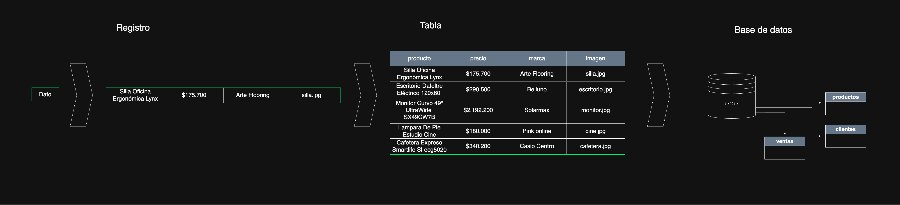

# Jerarquía clásica de los datos:

> El diagrama explica visualmente la jerarquía clásica de los datos:

    Dato  
      ↓  
    Registro  
      ↓  
    Tabla (muchos registros)  
      ↓  
    Base de datos (muchas tablas relacionadas)  

> Una base de datos no es algo mágico ni muy complicado.
> En realidad, es solo una forma ordenada de guardar información.

🟢 Paso 1: El dato (registro)

> Primero pensemos en un solo dato.
> Por ejemplo, un producto de una tienda.
> Imaginemos esto:

    Producto: Silla Oficina Ergonómica Lynx  
    Precio: $175.700  
    Marca: Arte Flooring  
    Imagen: silla.jpg  

> Todo esto junto forma un registro.  
> Es una sola cosa, una sola fila de información.

📌 Idea clave:  
👉 Un registro es la información completa de un solo elemento.

🟢 Paso 2: La tabla

> Ahora, ¿qué pasa si no tengo un solo producto, sino muchos?
> Ya no tengo solo una silla, también tengo:

    · Escritorios  
    · Monitores  
    · Lámparas  
    · Cafeteras  

> En lugar de guardar cada producto por separado, los pongo todos juntos en una tabla.

> La tabla
> Tiene columnas (producto, precio, marca, imagen)
> Tiene filas (cada fila es un producto distinto)

> Entonces, una tabla es simplemente una lista ordenada de registros que tienen la misma estructura de organización.

📌 Idea clave:  
👉 Una tabla es un conjunto de registros.

🟢 Paso 3: La base de datos

> Pero una tienda real no maneja solo productos.
> También maneja:

    · Clientes  
    · Ventas  
    · Pagos  

> En vez de tener todo desordenado, separamos la información en distintas tablas.

> Por ejemplo:

    · Tabla productos  
    · Tabla clientes  
    · Tabla ventas  

> A todo ese conjunto de tablas lo llamamos base de datos.

📌 Idea clave:  
👉 Una base de datos es un conjunto de tablas relacionadas.

🟢 Relación entre tablas (sin tecnicismos)

> La tabla ventas funciona como un nexo.

> Una venta:
> Corresponde a un cliente
> Incluye uno o más productos

> Por eso las tablas se conectan entre sí.
> No están aisladas, trabajan juntas.

🧠 Cierre conceptual

> Resumamos todo en una sola frase:

👉 Un registro es una fila  
👉 Una tabla es un conjunto de registros  
👉 Una base de datos es un conjunto de tablas relacionadas

> Si entendemos esto, ya entendemos la base de las bases de datos. 😊