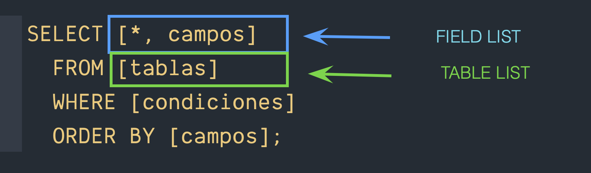

# Filtrado de registros
> Cuándo hacemos una consulta sin ningún filtro obtenemos un listado de todos los registros que hay dentro de la tabla
> No siempre vamos a querer obtener la totalidad de registros
> Filtrar registros significa que vamos a aplicar una condición para obtener sólo algunos registros (los que cumplan con esa condición)

    SELECT [*, campos]  
      FROM [tablas]  
      ORDER BY [campos];  

> Podemos implementar un filtro mediante la palabra reservada **WHERE**

    SELECT [*, campos]  
      FROM [tablas]  
      WHERE [condiciones]  
      ORDER BY [campos];  

> Obtener un listado de todos los productos de la marca "Philips" (5)

    SELECT producto, precio  
      FROM productos  
      WHERE idMarca = 5;  

> Obtener un listado de los productos con un precio hasta 1000000

    SELECT producto, precio  
      FROM productos  
      WHERE precio <= 1000000;  

> Obtener un listado de clientes con una fecha de alta a partir de junio de 2024

    SELECT apellido, nombre, fechaAlta  
      FROM clientes  
      WHERE fechaAlta >= '2024-06-01';  

> Obtener un listado de los productos de la marca Apple y con un precio hasta 1 millón

    SELECT producto, precio  
      FROM productos  
      WHERE precio <= 1000000  
       AND idMarca = 1  
      ORDER BY precio;  

> Obtener un listado de productos con un precio entre 100,000 y 1,000,000

    SELECT producto, precio    
      FROM productos  
      WHERE precio >= 100000  
        AND precio <= 1000000  
        ORDER By precio;  

> Uso del operador BETWEEN

    SELECT producto, precio  
      FROM productos  
      WHERE precio BETWEEN 100000 AND 1000000;  

> Obtener un listado de los clientes con fecha de alta del mes de mayo de 2024

    SELECT apellido, nombre, fechaAlta  
      FROM clientes  
      WHERE fechaAlta BETWEEN '2024-05-01' and '2024-05-31';    

> Funciones de fecha:  
> En SQL tenemos varias funciones de fecha.  
> En este caso vamos a utilizar las funciones MONTH() y YEAR()  

    SELECT apellido, nombre, fechaAlta  
      FROM clientes  
	  WHERE MONTH(fechaAlta) = 5    
        AND YEAR(fechaAlta) = 2024;  

> Obtener un listado de todos los productos de las marcas "Philips" (5) y "BOSE" (7)·

    SELECT producto, precio  
      FROM productos  
      WHERE idMarca = 5  
        OR  idMarca = 7;  

> Operador IN()  

    SELECT producto, precio      
      FROM productos      
      WHERE idMarca IN(5,7);  

    SELECT apellido, nombre, fechaAlta  
      FROM clientes
      WHERE apellido IN('lopez', 'perez');  

